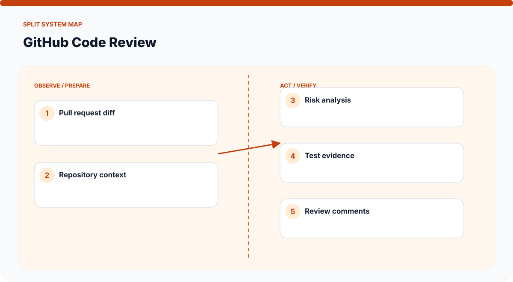
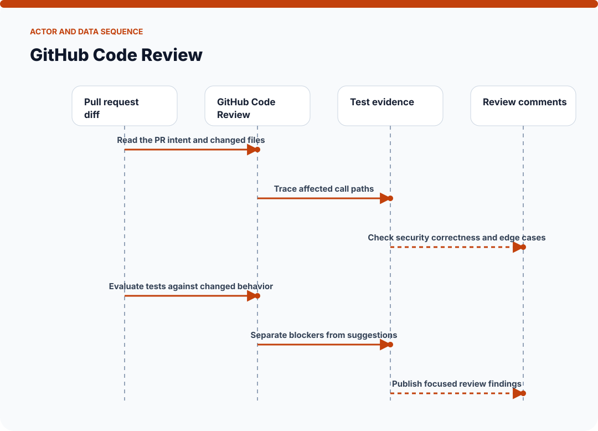
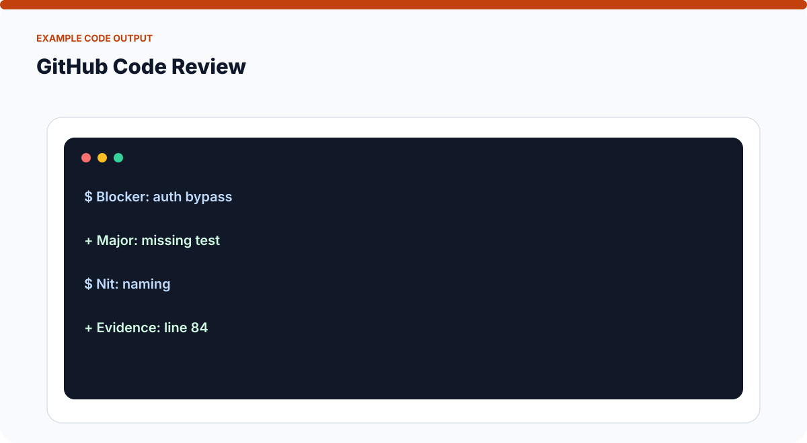
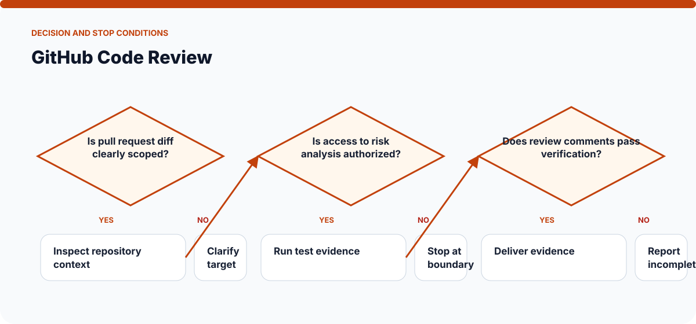

# How GitHub Code Review Works

The visuals on this page are static SVGs, so they render directly on GitHub on phones and desktop browsers. Each one is generated from a model specific to this skill.

## System architecture

### Components

- **1. Pull request diff:** participates in read the pr intent and changed files.
- **2. Repository context:** participates in trace affected call paths.
- **3. Risk analysis:** participates in check security correctness and edge cases.
- **4. Test evidence:** participates in evaluate tests against changed behavior.
- **5. Review comments:** participates in separate blockers from suggestions.

## Actor and data sequence

### 1. Read the PR intent and changed files

**Primary surface:** `Pull request diff`

Record the concrete input, the operation performed, and the evidence produced at this stage. Continue only when the output is sufficient for the next stage; otherwise preserve the blocker and stop.
### 2. Trace affected call paths

**Primary surface:** `Repository context`

Record the concrete input, the operation performed, and the evidence produced at this stage. Continue only when the output is sufficient for the next stage; otherwise preserve the blocker and stop.
### 3. Check security correctness and edge cases

**Primary surface:** `Risk analysis`

Record the concrete input, the operation performed, and the evidence produced at this stage. Continue only when the output is sufficient for the next stage; otherwise preserve the blocker and stop.
### 4. Evaluate tests against changed behavior

**Primary surface:** `Test evidence`

Record the concrete input, the operation performed, and the evidence produced at this stage. Continue only when the output is sufficient for the next stage; otherwise preserve the blocker and stop.
### 5. Separate blockers from suggestions

**Primary surface:** `Review comments`

Record the concrete input, the operation performed, and the evidence produced at this stage. Continue only when the output is sufficient for the next stage; otherwise preserve the blocker and stop.
### 6. Publish focused review findings

**Primary surface:** `Pull request diff`

Record the concrete input, the operation performed, and the evidence produced at this stage. Continue only when the output is sufficient for the next stage; otherwise preserve the blocker and stop.

## Example output shape

The example is a visual contract: a real run may look different, but it should expose comparable state, provenance, and verification information. It is not presented as evidence of a live external action.

## Decision and stop conditions

The workflow stops when the target is ambiguous, the relevant surface is unavailable or unauthorized, or the final artifact cannot be checked. A logged-in session or successful tool call is not by itself proof that the requested outcome is complete.

## Verification checklist

- Confirm every component shown in the system map exists in the target environment.
- Trace the actor sequence using actual tool output or artifact state.
- Compare the result with the example-output information contract.
- Re-read or reopen the final artifact instead of trusting an attempt message.
- Report omitted stages, unsupported capabilities, and remaining human decisions.
