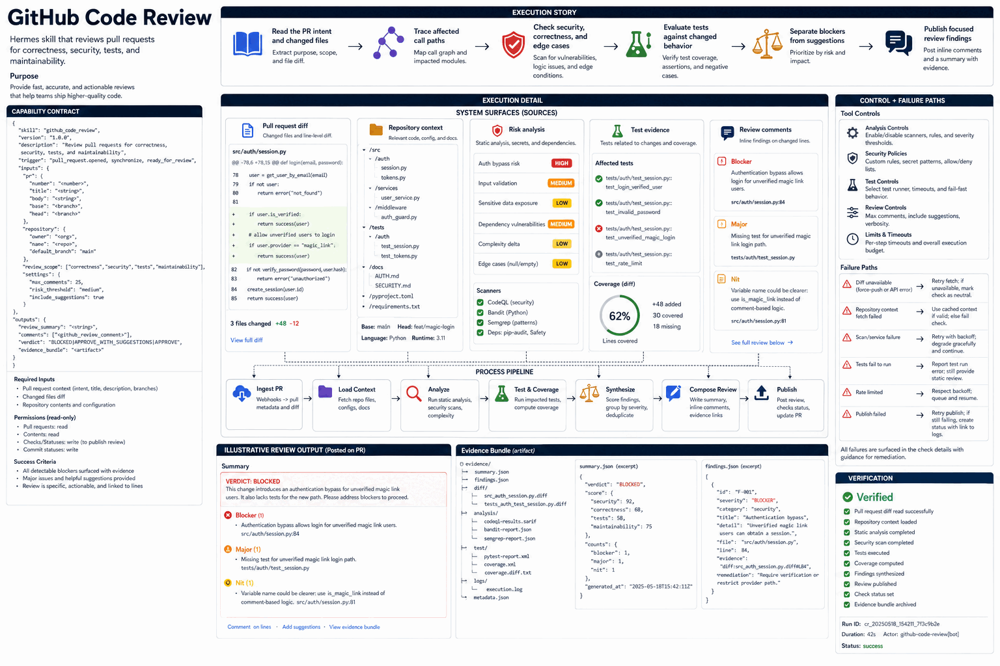

# How GitHub Code Review Works

Review pull requests for correctness, security, tests, and maintainability.

## Stages

### 1. Read the PR intent and changed files

**Primary surface:** `Pull request diff`

Record the input, operation, observable output, and any decision that changes scope. Stop here if the output is missing, contradictory, or insufficient for the next stage.
### 2. Trace affected call paths

**Primary surface:** `Repository context`

Record the input, operation, observable output, and any decision that changes scope. Stop here if the output is missing, contradictory, or insufficient for the next stage.
### 3. Check security correctness and edge cases

**Primary surface:** `Risk analysis`

Record the input, operation, observable output, and any decision that changes scope. Stop here if the output is missing, contradictory, or insufficient for the next stage.
### 4. Evaluate tests against changed behavior

**Primary surface:** `Test evidence`

Record the input, operation, observable output, and any decision that changes scope. Stop here if the output is missing, contradictory, or insufficient for the next stage.
### 5. Separate blockers from suggestions

**Primary surface:** `Review comments`

Record the input, operation, observable output, and any decision that changes scope. Stop here if the output is missing, contradictory, or insufficient for the next stage.
### 6. Publish focused review findings

**Primary surface:** `Review comments`

Record the input, operation, observable output, and any decision that changes scope. Stop here if the output is missing, contradictory, or insufficient for the next stage.

## Failure handling

- **Authorization failure:** do not probe credentials or broaden access; report the missing authority.
- **Target ambiguity:** stop before mutation and request the minimum identifying information.
- **Tool or service failure:** retain error evidence, retry only safe transient failures, and cap retries.
- **Verification failure:** classify the run as incomplete even when the preceding operation returned success.

## Completion evidence

The handoff should contain the original request, inspection state, preview or plan, exact execution result, direct verification, and a final receipt naming limitations and withheld actions.
